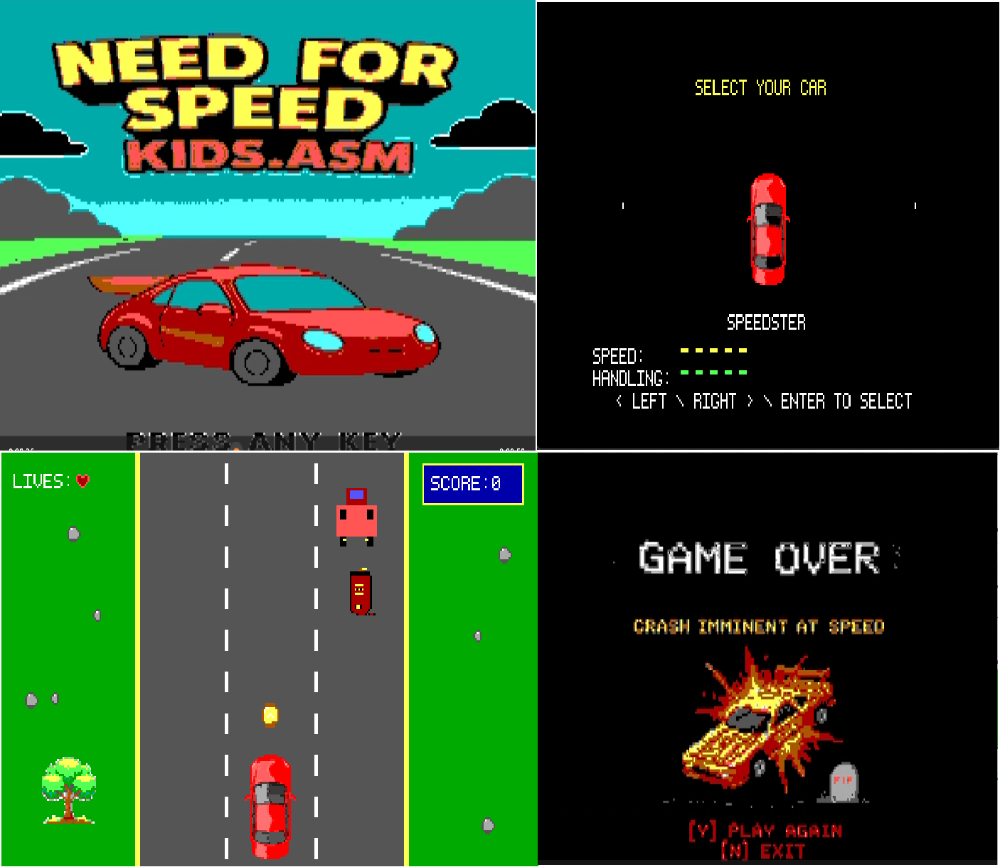

# 🚗 Need For Speed Kids.asm — Race Car Game
### *8086 Assembly • Mode 13h VGA Graphics • DOS Project*

This repository contains the *Need For Speed Kids* race car game, developed entirely in **8086 Assembly Language** using **Mode 13h (320×200, 256-color VGA)** graphics.  
All rendering, palette handling, and sprite drawing are implemented manually using BIOS and DOS interrupts.

---

## 📌 Project Details

- **Platform:** DOS (16-bit Real Mode)  
- **Graphics Mode:** Mode 13h (0x13), 320 × 200 resolution  
- **Color Depth:** 256 colors  
- **Assembler:** NASM / TASM / MASM  
- **Primary File:** `carProj.asm`  

This phase includes **intro screen rendering**, **static game view**, custom **RAW sprite handling**, and **palette loading** via file I/O.

---

## 📂 Included Files (Place ALL in the same directory)

| File Name        | Description |
|------------------|-------------|
| `carProj.asm`    | Main assembly source code |
| `Pallete.PAL`    | 256-color VGA palette (RGB bytes) |
| `IntroSc2.RAW`   | Intro screen (320 × 200 RAW) |
| `Car.RAW`        | Player car sprite (64 × 64 RAW) |
| `treeImg.RAW`    | Tree sprite 1 (64 × 64 RAW) |
| `tree2Img.RAW`   | Tree sprite 2 (32 × 32 RAW) |
| `*.RAW`          | Additional decorative sprites |

> ⚠️ All files must stay together; the game loads them using `INT 21h` file I/O.

---

## 🎮 How It Works

1. The game loads the **intro screen** from a RAW image file.  
2. Press **any key** to proceed.  
3. A **static race track environment** is drawn with:
   - the player car  
   - trees  
   - road graphics  
   - background elements  

---

## ⚙️ Technical Highlights

### 🖼️ Graphics & Rendering
- Mode 13h video initialization  
- Direct VRAM writes to segment `A000h`  
- RAW sprite loading (byte-by-byte)  
- Intro screen blitting (64,000 bytes)  
- VGA palette loading from `.PAL` file  

## 🖼️ Game Preview

### 📌 Game Screens


### 🧰 Program Structure
- `InitVideo` — switch to 320×200×256 mode  
- `LoadPalette` — load `.PAL` file into VGA ports  
- `LoadSprite` — read RAW sprite files  
- `DrawSprite` — custom blitting routine  

### 📁 File I/O
- Uses `INT 21h` interrupt for:
  - Opening files  
  - Reading bytes  
  - Closing files  

---

## ▶️ Running the Program

### **Assemble & Link (TASM Example)**
```bash
tasm carProj.asm
tlink carProj.obj
carProj.exe

Using DOSBox
mount c path_to_folder
c:
carProj.exe
```

## 🧑‍🏫 Educational Purpose

- This project showcases foundational concepts in:

- 8086 assembly graphics

- VGA Mode 13h programming

- Sprite rendering and raw pixel handling

- Low-level memory and segmentation

- DOS file I/O using interrupts

- Modular assembly program architecture

- Ideal for coursework in Assembly Language, Computer Organization, and Graphics Programming.

## 📜 License

This project is licensed under the MIT License.
You are free to use, modify, and distribute this software.

## 👨‍💻 Authors

Muhammad Hasan Butt  
Kabeer Ahmed Shahzeb